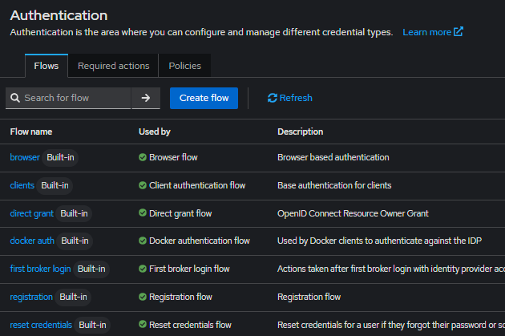

## User Federation
* Keycloak 인증(Login)시 외부DB의 사용자 정보를 이용하여 인증처리를 하고자 할때 User Federation 기능을 사용해야 한다.
* 이를 위하여 아래와 같은 Class를 상속받아 구현하면 외부 DB로 인증 처리를 할 수 있다.

## User Federation 구현을 위한 방법
* 상속 Class
  * UserStorageProvider
  * UserLookupProvider
  * CredentialInputValidator
```java
// 상속시 구현체 샘플
public class MyFederationProvider  implements UserStorageProvider, UserLookupProvider, CredentialInputValidator {

  @Override
  public boolean supportsCredentialType(String s) {
    return false;
  }

  @Override
  public boolean isConfiguredFor(RealmModel realmModel, UserModel userModel, String s) {
    return false;
  }

  @Override
  public boolean isValid(RealmModel realmModel, UserModel userModel, CredentialInput credentialInput) {
    return false;
  }

  @Override
  public void close() {

  }

  @Override
  public UserModel getUserById(RealmModel realmModel, String s) {
    return null;
  }

  @Override
  public UserModel getUserByUsername(RealmModel realmModel, String s) {
    return null;
  }

  @Override
  public UserModel getUserByEmail(RealmModel realmModel, String s) {
    return null;
  }
}
```
* 본 프로젝트의 JDBC로 간단히 구현된 MariaDBUserFederationProvider와 MariaDBUserFederationProviderFactory 참조한다.

## 샘플 프로젝트에서 참조하는 외부 사용자 Table 정보
* create users
```
DROP   TABLE `users`;
CREATE TABLE `users` (
  `username` varchar(50) NOT NULL,
  `password` varchar(300) DEFAULT NULL,
  `salt` varchar(300) DEFAULT NULL,
  `email` varchar(100) DEFAULT NULL,
  `first_name` varchar(100) DEFAULT NULL,
  `last_name` varchar(100) DEFAULT NULL,
  PRIMARY KEY (`username`)
) ENGINE=InnoDB DEFAULT CHARSET=utf8mb4 COLLATE=utf8mb4_unicode_ci;

```

## KEYCLOAK PASSWORD Format
* Table name : credential
* Column name : credential_data 와 secret_data
```
# credential_data
{
  "hashIterations": 27500,
  "algorithm": "pbkdf2-sha256",
  "type": "password", 
  "saltSizeBytes": 16
}

# secret_data
{
  "value": "YTNzjXmUQ43nWBJVO35v9kNX1g2Qxw2pbx5swzLnJKk=",
  "salt": "3xXq8YwJYxU3bV3xas1Hbg=="
}

```

## Keycloak 인증 Flow (Authentication Flow)
* Keycloak 에서 로그인시, 회원가입시 마다 서로 다른 Flow 를 따른다.
* 이 Flow를 제어하는 기능이 Authenticatio Flow 이다.

* Web Browser에서 로그인 시 -> browser flow 를 타고,
* Token endpoint를 이용해서 ID/PW 방식으로 인증 후 Access Token을 받아가려면 -> direct grant flow를 탄다.

## User Federation 등록 시 인증 Flow
* Keycloak 인증(Login) 시 User Federation이 등록되어 있으면,
* User Federation의 우선순위를 따라 순차로 수행하고, 이후 Main Flow를 수행한다.
```
// Main Flow 흐름
1. 사용자 조회
   - KEYCLOAK.USER_ENTITY read... : Keycloak 인증 테이블에 사용자 등록 여부 체크
2. 패스워드 검증
   - USER_ENTITY에 없으면 -> 이때 User Federation 수행
   - USER_ENTITY에 있으면 -> KEYCLOAK.CREDENTIALS 의 비번으로 인증 수행
3. 속성 및 요구사항 확인
   - USER_ATTRIBUTE check
   - USER_REQUIRED_ACTION check
4. 세션 생성
   - OFFLINE_USER_SESSION insert
   - OFFLINE_CLIENT_SESSION insert
5. 권한 및 그룹 확인
   - USER_GROUP check
   - USER ROLE MAPPING check
  
// User Federation으로 인증 시 흐름
1. FEDERATED_USER check
2. FED_USER_ATTRIBUTE check
3. FED_USER_REQUIRED_ACTION check
```

## 결론
> ### User Federation은 LDAP과 같이 기존에 잘 사용하던 인증 시스템과 연동시 필요하며, 새로운 사용자를 처음부터 가입시킬 때는 굳이 사용할 필요가 없다.
> ### 왜냐하면 Keycloak은 항상 Main Flow 위주로 동작하기 때문에 User federation 연동시 고려해야할 변수가 너무 많고, 잘 제어가 힘들다. (Authentication Flow 제어)
 

---

## TEST
* keycloak-test-log.txt 참고
